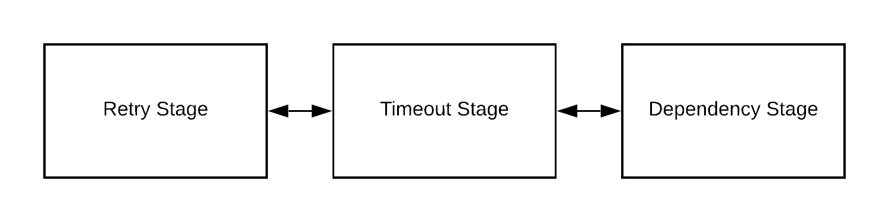

# Quartermaster - Simulating with Quartermaster

A system can be generalized as a network of stages, each consisting of a queue for inbound events, a worker pool to process events from the queue, and a set of overloadable event handlers.

This document describes simulatoin of the Typescript implementation of the Quartermaster model. To see the model itself, [read up on the description](model.md). To view some actual code, [check out our examples](examples.md).

## Table of Contents

**[1. Stage](#Stage)** \
**[2. Queue](#Queue)** \
**[3. Worker Pool](#Worker-Pool)** \
**[4. Event](#Event)** \
**[5. Event Handlers](#Event-Handlers)** \
**[6. Simulation](#Simulation)** \
**[7. Timing](#Timing)**

## Stage

A set of system components and techniques can be generalized as a network, or tree, of stages.


_Diagram 1: A system with a retry and timeout modeled as a chain of stages_

The chain of stages can be accomplished in a few ways. A `WrappedStage` is provided as a helper class to construct these chains of stages using the decorator pattern. The `workOn()` method delivers the event to the wrapped stage, optionally waiting for a response.

For example, the `Timeout` stage's implementation is:

```typescript
export class Timeout extends WrappedStage {
  async workOn(event: Event): Promise<void> {
    //const tookTooLong = ...
    await Promise.race([tookTooLong, this.wrapped.accept(event)]);
  }
}
```

Events arrive to a stage in `accept(event)`. By default, no other methods are available for other stages to call. This is not a requirement of the model however, and stages can be more tightly coupled by extending the core functionality.

Furthermore, the default behavior (and flow) of an event through a stage is controlled by `accept(event)`, which can also be overwritten if necessary.

Using this pattern makes it simple to create that network of stages:

```typescript
const db = new Database();
const retry = new Retry(db);
const service = new BuildService(retry);
```

## Queue

When events arrive at a stage, the simulation will automatically try to insert them into a queue. By default, stages have a `NoQueue` which behaves as if there was no queue there in the first place (there is no wait time, all events get served immediately by the stage).

The queue contract is different from typical queue contracts in actual systems. The reason for this is due to how the simulation is driven. Under the hood, we have this behavior when an event arrives at a stage:

```typescript
accept(event) {
  stage.add(event);     // can be accepted or rejected
  queue.enqueue(event); // blocks until the event is ready to be worked on
  stage.workOn(event);  // triggers the event handler
}
```

The real job of the queue in the simulation software is to

1. block an event from flowing through the system until it actually should
2. limit the concurrent number of events in a system at the same time

It does this by 1) the enqueue method and 2) the worker pool

### Worker Pool

Workers are created, destroyed, and assigned work by the queue that contains them. A stage can influence the worker pool by calling methods on the queue itself, such as `queue.setNumWorkers(num)`. This can even happen during the run of a simulation. You can prevent workers from servicing events in the queue by keeping them busy. This can be done in a variety of ways, by either never returning during some event handler of the event they are servicing or never calling `free()` on the Worker object (likely would need to be done in the stage, by overriding the default event flow in `accept()`).

## Event

The event class wraps a required, public `key` property, which is just a string. Events can enter your model in one of two ways.

1. You manually insert the event into whatever stage is first.
2. You use `simulation.run(stage, numEventsToSend);`

For the latter, see the [section on simulation](#Simulation)

## Event Handlers

As an event flows through a stage these event handlers are triggered. To interrupt the flow and prevent an event from triggering additional methods, any method can `throw` an error or return a Promise which rejects. This is demonstrated in `add(event)`'s default implementation:

```typescript
protected async add(event: Event): Promise<void> {
  if (this.inQueue.isFull()) {
    return Promise.reject("fail");
  }
}
```

If an event finishes without throwing an error or returning a rejected promise, the event will continue to flow through the stage. The goal is to distill the result of all stages down into a single `success` or a `fail`. An event that passes through a stage without throwing an error, regardless of the actual data returned and operations performed, results in a `success`. Likewise, an event that passes through a stage that results in a rejected Promise or thrown error, regardless of the actual error thrown or rejected promise reason, results in a `fail`.

The simulation automatically keeps track of the number of invocations and the execution time of each of these event handlers. This data is available on the `stage` objects themselves in the `traffic` and `time` properties. This information is also available to be printed out in a rich output by calling `stageSummary([stageA, stageB, ...])`.

## Simulation

We provide a central `Simulation` class to handle work we expect to be common among users. The simulation class drives creating events and sending them to a stage at a specified stage. An instance is available globally by importing `simulation`.

Most programs will use the simulation like this:

```typescript
// set up various stages

work();
async function work() {
  const events = await simulation.run(stage, 20000);

  // perform various analysis
}
```

The simulation generates events based on a few properties of the simulation:

| Property             | Effect                                                                                        |
| -------------------- | --------------------------------------------------------------------------------------------- |
| `eventsPer1000Ticks` | The rate at which events are sent to the stage                                                |
| `keyspaceMean`       | The mean of a discrete normal distribution, which is used to generate the `key`               |
| `keyspaceStd`        | The standard deviation of a discrete normal distribution, which is used to generate the `key` |

You can change any of these properties as the simulation is running. They are accessible on the global `simulation` object.

## Timing

In this simulation, the activity of all stages is coordinated using the abstract notion of time referred to as a _tick_. This increases the speed at which simulations occur and helps decouple the simulation from hardware (and software) limitations.

The simulation includes the `Metronome` class which provides this abstraction. An instance is available globally by importing `metronome`. The global metronome class drives all timing parts of the simulation. When using `simulation.run(...)`, the metronome is automatically started. To start it manually, you can use `metronome.start()`.

The `Metronome` class exposes a `setTimeout(func, ticks)` and `setInterval(func, ticks)`. Some convenience methods,such as `wait(ticks)`, are available to faciliate clean code.

For example, if you are in a stage where the event handler needs to block (to simulate work being done), your `workOn` might look like this:

```typescript
async workOn(event: Event): Promise<void> {
  const latency = 20
  await metronome.wait(latency);
}
```
